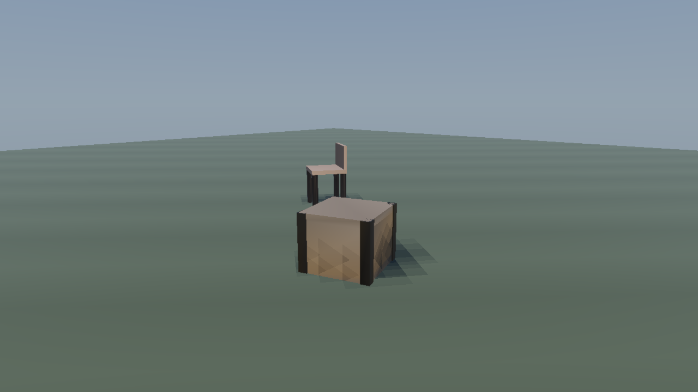
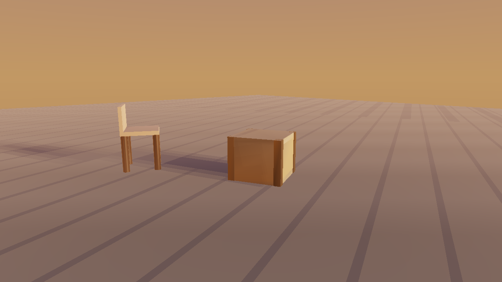

<div align="center">

# IronEngine-BonaFide

### An API-only Python render engine — PBR meshes, point clouds, and IBL lighting with a deterministic CPU reference path

[](https://github.com/dunknowcoding/IronEngine-BonaFide/actions/workflows/ci.yml)
[](https://www.python.org/downloads/)
[](LICENSE)
[]()
[](https://pytorch.org/)
[]()

**Render meshes and point clouds into lit, shadowed, tonemapped images — one `render(...)` call, tensor in, tensor out.**

[Quick Start](#-quick-start) · [Screenshots](#-screenshots) · [Feature Matrix](#-feature-matrix) · [Architecture](#-architecture) · [User Guide](docs/USER_GUIDE.md) · [API Reference](docs/API_REFERENCE.md)



</div>

---

## What is this?

**IronEngine-BonaFide** is a from-scratch, API-only render engine. You build a
`Scene` out of meshes, point clouds, lights, and image-based lighting; you call
`render(engine, scene, camera, config)`; you get a `torch.Tensor` back —
RGB plus optional depth, normals, IDs, and albedo sensor outputs.

It is the drop-in renderer for the **IronEngine** family:
[3DCreator](https://github.com/dunknowcoding/IronEngine-3DCreator) (prompt → point cloud)
and Sim (3D simulation for RL) integrate through headless-safe shims.

The engine has three backend paths — CUDA (via optional gsplat / nvdiffrast /
NVIDIA Warp kernels), wgpu-py, and a **pure NumPy/PyTorch CPU reference
rasterizer** that is fully functional, deterministic, and perspective-correct.
`Engine.auto()` picks the best available and **honestly falls back to CPU**
when the GPU kernel extras are not installed.

### Honest framing

We will not beat Vulkan or PhysX in raw throughput from Python. Our pitch is
*"lighter than panda3d, more capable than taichi, differentiable by design,
tensor-native end-to-end."* Today the battle-tested path is the CPU reference
backend; the CUDA kernel extras and wgpu WGSL pipelines are real code but are
explicitly roadmap (see the [feature matrix](#-feature-matrix)). If that's
what you need — read on.

---

## 📸 Screenshots

Both frames were rendered end-to-end by BonaFide (CPU backend, 1280×720)
from scenes exported by the IronEngine pipeline.

| Daylight | Golden hour |
|---|---|
|  |  |

*Left: procedural-sky IBL + `envmap` background + cascaded shadow maps +
vertex-colored GLB assets. Right: warm low-sun IBL, long shadows, and
texture-mapped plank flooring sampled through the PBR pass.*

---

## 🚀 Quick Start

### Install

```bash
pip install -e .
```

Extras (all optional — the core engine runs on NumPy + PyTorch alone):

| Extra       | Pulls                                               | When                                   |
|-------------|-----------------------------------------------------|----------------------------------------|
| `[cuda]`    | `cupy-cuda12x`, `warp-lang`, `gsplat`, `nvdiffrast` | NVIDIA GPU kernels (roadmap paths)     |
| `[wgpu]`    | `wgpu`                                              | AMD / Intel / Apple GPU (roadmap path) |
| `[formats]` | `pyktx`, `openvdb`, `usd-core`, OpenEXR             | KTX2, VDB, USD asset support           |
| `[viewers]` | `rerun-sdk`, `polyscope`                            | Bring-your-own interactive viewer      |
| `[dev]`     | `pytest`, `pyright`, `ruff`                         | Development                            |
| `[all]`     | all of the above                                    | Everything                             |

### Render a scene in 10 lines

Verified against the current API — copy, paste, run:

```python
import numpy as np
from ironengine_bonafide.api import (
    Engine, Scene, Mesh, PBRMaterial, PerspectiveCamera,
    DirectionalLight, RenderConfig, render,
)

engine = Engine.auto()                    # cuda → wgpu → cpu fallback
quad = Mesh.from_arrays(positions=np.array([[-1,-1,0],[1,-1,0],[1,1,0],[-1,1,0]], np.float32),
                        indices=np.array([[0,1,2],[0,2,3]]),
                        material=PBRMaterial(albedo=(0.85, 0.55, 0.3), roughness=0.45))
scene = Scene().add(quad).add(DirectionalLight(direction=(-0.4, -1.0, -0.3), intensity=3.0))
cam = PerspectiveCamera(position=(0, 0, 3), look_at=(0, 0, 0), fov_deg=45)
out = render(engine, scene, cam, RenderConfig(width=640, height=360, output_color_space="sRGB"))
out.rgb.save("preview.png", display_ready=True)
```

More recipes in [`examples/`](examples/) — GLB/OBJ mesh rendering, point
clouds, 3DCreator session → image, Sim shim, and an experimental
differentiable inverse-rendering demo.

### Drop into the existing 3DCreator UI

```python
# At app start, before any rendering happens:
from ironengine_bonafide.integrations.creator3d import install
install()
# 3DCreator's UI now renders through BonaFide. No 3DCreator code changed.
```

### Drop into IronEngine-Sim

```python
from ironengine_bonafide.integrations.sim import install
install()    # patches ironengine_sim.rendering.RenderWorld — headless-safe
```

---

## 📦 Feature Matrix

Honest status — ✅ means implemented and covered by the test suite
(74 passed, 10 skipped as of this release); 🚧 means real code exists but
the path is not production-ready.

| Subsystem | Status | Notes |
|---|---|---|
| **Sky pass** | ✅ | Solid, gradient, and `envmap` equirect backgrounds |
| **Image-based lighting** | ✅ | Equirect diffuse irradiance + roughness-mip specular from HDR/EXR or in-memory pixels |
| **CSM shadows** | ✅ | Cascaded shadow maps on **all** backends, including CPU |
| **CPU rasterizer** | ✅ | Perspective-correct, deterministic (seeded, bit-exact within the backend) |
| **PBR shading** | ✅ | Cook-Torrance GGX specular; `roughness` / `metallic` / `emissive` honored |
| **Texture maps** | ✅ | Albedo / normal / metallic-roughness / AO map sampling in `PbrPass` — maps are supplied through the API |
| **Tonemap** | ✅ | Single, consistent ACES filmic → sRGB pipeline |
| **GLB / glTF loader** | ✅ | Node transforms, `byteStride` interleaved buffers, multi-buffer, normalized `COLOR_0` |
| **`.iemodel.json` loader** | ✅ | 3DCreator manifest sidecar, schema versions `iemodel/1` and `iemodel/2` |
| **Asset formats** | ✅ | PLY · PCD · OBJ · GLB · HDR · EXR · PNG/JPG (KTX2 / VDB / USD behind `[formats]`) |
| **3DCreator + Sim shims** | ✅ | Headless-safe monkey-patch integrations, TRS transform bridging |
| **Render bundles** | ✅ | `.bnf` scene + camera + config snapshots round-trip for reproducibility |
| **Sensor outputs** | ✅ | RGB · depth · world normals · instance IDs · GBuffer albedo as `torch.Tensor`s |
| **Differentiable render** | 🚧 | `render_differentiable()` exists (torch autograd through the CPU path); experimental |
| **GLB embedded textures** | 🚧 | Texture *references* inside GLBs are not resolved yet — load maps via the API |
| **CUDA kernel extras** | 🚧 | gsplat / nvdiffrast / Warp paths are wired but optional; `Engine.auto()` falls back to CPU when absent |
| **wgpu WGSL pipelines** | 🚧 | Backend scaffolding present; WGSL pipelines not feature-complete |
| **TAA / SMAA** | 🚧 | Pass stubs exist; true temporal/smaa anti-aliasing not yet (FXAA works) |
| **Neural FX / volumetrics / fluids** | 🚧 | Pass scaffolding only — denoise, upscale, relight, smoke, water are roadmap |

---

## 🏛 Architecture

```
┌──────────────────────────────────────────────────────────────────┐
│ L5  Integrations: 3DCreator shim · Sim shim · CLI · folder mount │
├──────────────────────────────────────────────────────────────────┤
│ L4  Public API:  render(scene, camera, config) → RenderOutputs   │
├──────────────────────────────────────────────────────────────────┤
│ L3  Render passes: sky · CSM shadow · splat · PBR · post (ACES)  │
├──────────────────────────────────────────────────────────────────┤
│ L2  Scene graph + asset cache + material binding + asset mount   │
├──────────────────────────────────────────────────────────────────┤
│ L1  Kernel backends:  CUDAPath · WGPUPath · CPUPath              │
├──────────────────────────────────────────────────────────────────┤
│ L0  Tensor core: PyTorch + NumPy (CuPy/DLPack on the CUDA path)  │
└──────────────────────────────────────────────────────────────────┘
```

`Engine.auto()` picks the best path available; you can pin one with
`Engine.cuda()`, `Engine.wgpu()`, `Engine.cpu()`. The CPU path is the
reference implementation every other backend is validated against.

---

## 📚 Documentation

- **[User Guide](docs/USER_GUIDE.md)** — installation, scenes, cameras, materials, recipes, troubleshooting
- **[API Reference](docs/API_REFERENCE.md)** — every class, method, and parameter
- **[Architecture Notes](docs/ARCHITECTURE.md)** — layer-by-layer design rationale
- **[Performance Notes](docs/PERFORMANCE.md)** — honest comparison vs panda3d / taichi

---

## 🧠 What this is not

- **Not** a Vulkan / PhysX competitor on raw FPS. We wrap Python-accessible kernels; native engines wrap C++.
- **Not** a real-time interactive viewer. We're API-only. Plug `rerun-sdk` or `polyscope` if you need a window.
- **Not** a NeRFstudio replacement. Neural-field training helpers are roadmap, not a shipped framework.
- **Not** another OpenGL/forward-PBR viewer app. That's what the sibling IronEngine projects are for.

## 📜 License

Distributed under the **MIT License**. See [`LICENSE`](LICENSE) for full text.

---

<div align="center">

Built on top of NumPy and PyTorch, with optional CUDA kernels (gsplat, nvdiffrast, NVIDIA Warp) and wgpu-py.

By **DunknowCoding** · part of the **IronEngine** family.

</div>
