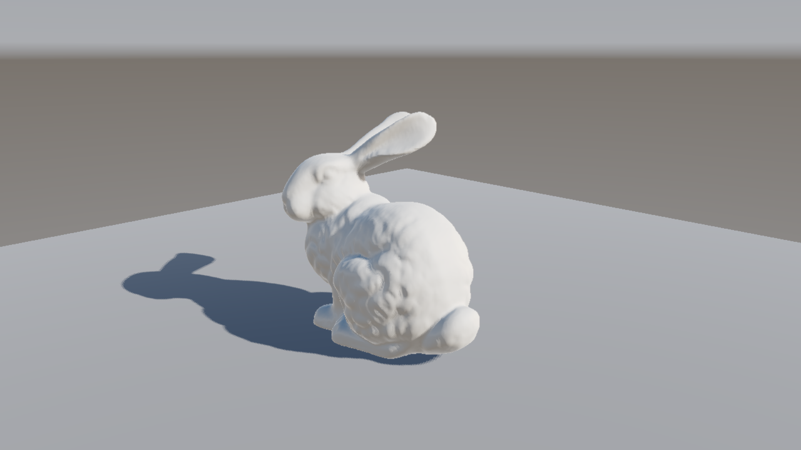
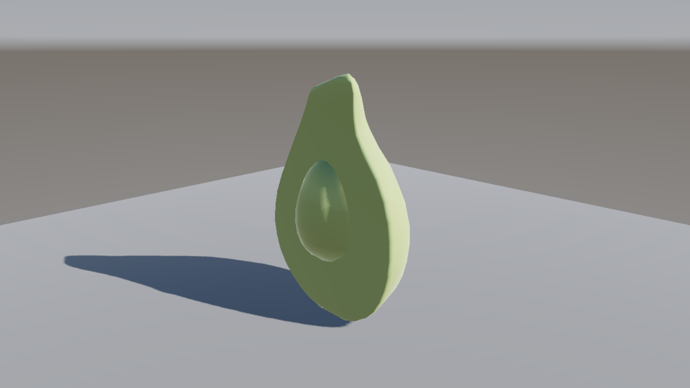
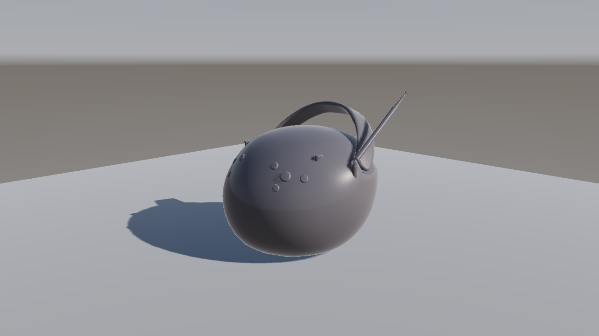
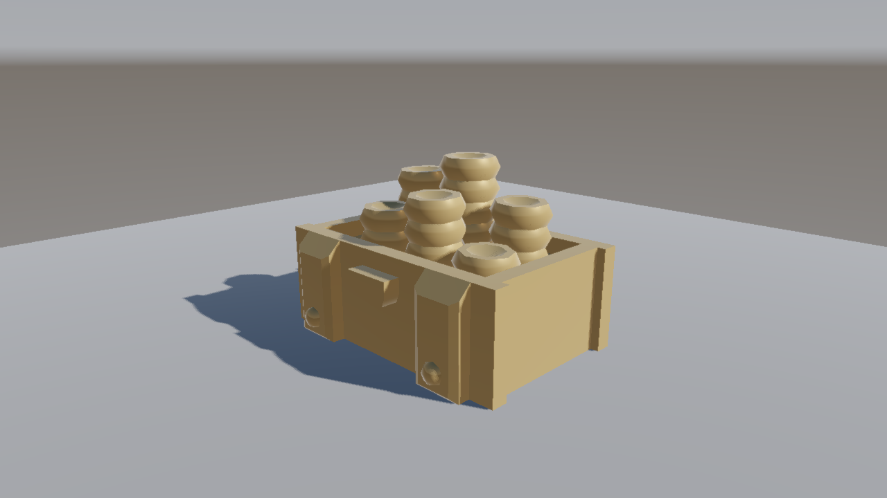
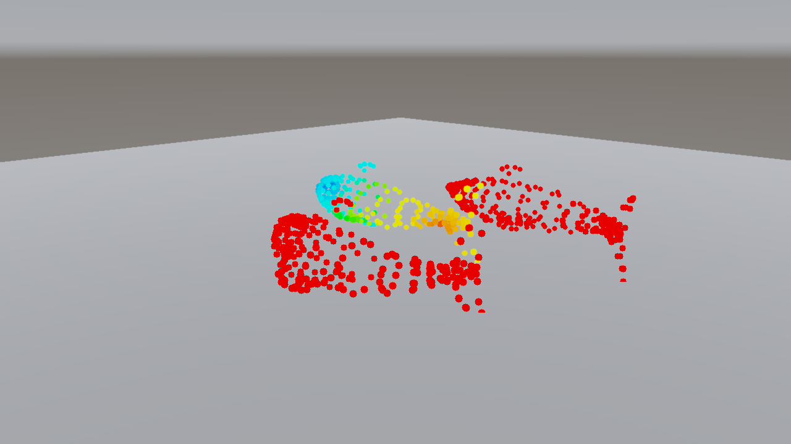

# BonaFide External-Asset Gallery

Real-world 3D content, rendered end-to-end by BonaFide's CPU reference
backend at 1280×720 (`output_color_space="sRGB"`, CSM shadows, procedural-sky
IBL + `envmap` background). Every frame is produced by
[`examples/render_external.py`](../examples/render_external.py) — one script
that loads each file through BonaFide's own loaders, auto-frames the camera
on the model's bounding box, aligns a shadow-casting sun with a sun disc
baked into the sky IBL, and adds a shadow-catching ground grid.

The models live in `external_assets/` (gitignored — never committed).
Sources, sizes and licenses: [`external_assets/SOURCES.md`](../external_assets/SOURCES.md).

Reproduce all frames:

```bash
python examples/render_external.py            # ~1 min total on CPU
python examples/render_external.py --only bunny
```

---

## Stanford Bunny — PLY triangle mesh



- **File:** `external_assets/stanford_bunny.ply` — ascii PLY, 35,947 vertices /
  69,451 faces (`bun_zipper.ply`)
- **Source:** <https://graphics.stanford.edu/pub/3Dscanrep/bunny.tar.gz>
- **License:** Stanford 3D Scanning Repository — free for research use
- **Loader:** `assets.loaders.ply.load_mesh` (vertex + face elements; the
  `confidence`/`intensity` vertex properties are parsed and ignored; smooth
  vertex normals are auto-computed by the rasterizer)

```python
from ironengine_bonafide.assets.loaders.ply import load_mesh
mesh = load_mesh("external_assets/stanford_bunny.ply").with_material(
    PBRMaterial(albedo=(0.78, 0.74, 0.68), roughness=0.55))
scene = Scene().add(mesh).add(DirectionalLight(direction=-SUN_DIR, intensity=1.2))
```

## Khronos Avocado — glTF-Binary



- **File:** `external_assets/Avocado.glb` — GLB, 682 triangles, 8.3 MB
  (bulk is textures)
- **Source:** <https://raw.githubusercontent.com/KhronosGroup/glTF-Sample-Models/main/2.0/Avocado/glTF-Binary/Avocado.glb>
- **License:** CC0 1.0 (Microsoft)
- **Loader:** `assets.loaders.gltf.load_primitives` (node world transforms
  applied; the flesh/skin split comes from `COLOR_0` vertex colors)

```python
from ironengine_bonafide.assets.loaders.gltf import load_primitives
for prim in load_primitives("external_assets/Avocado.glb"):
    scene.add(prim.mesh)   # per-primitive glTF material kept
```

> Texture *maps* are not sampled by any pass yet (the GLB's 8 MB of PNG
> textures are parsed but unused), so the gallery assigns a believable
> PBRMaterial; vertex colors carry the flesh/skin gradient.

## Khronos BoomBox — glTF-Binary



- **File:** `external_assets/BoomBox.glb` — GLB, 6,036 triangles, 10.9 MB
- **Source:** <https://raw.githubusercontent.com/KhronosGroup/glTF-Sample-Models/main/2.0/BoomBox/glTF-Binary/BoomBox.glb>
- **License:** CC0 1.0 (Microsoft)
- **Loader:** `assets.loaders.gltf.load_primitives`; the node's 180°-about-Y
  quaternion rotation is applied correctly

```python
for prim in load_primitives("external_assets/BoomBox.glb"):
    scene.add(prim.mesh.with_material(
        PBRMaterial(albedo=(0.14, 0.13, 0.14), roughness=0.35, metallic=0.05)))
```

## KayKit Golden Chest — Wavefront OBJ



- **File:** `external_assets/chest_gold.obj` — OBJ, 600 vertices / 1,106 triangles
- **Source:** <https://raw.githubusercontent.com/KayKit-Game-Assets/KayKit-Dungeon-Remastered-1.0/main/addons/kaykit_dungeon_remastered/Assets/obj/chest_gold.obj>
- **License:** CC0 1.0 (Kay Lousberg)
- **Loader:** `Mesh.from_obj` (`v/vn/vt/f`, fan triangulation)

```python
mesh = Mesh.from_obj("external_assets/chest_gold.obj").with_material(
    PBRMaterial(albedo=(0.55, 0.38, 0.18), roughness=0.5, metallic=0.35))
```

> The OBJ loader ignores `mtllib`, so material colors come from the assigned
> PBRMaterial, not the `.mtl` file.

## Dolphins — colored point cloud (ascii PLY)



- **File:** `external_assets/dolphins_colored.ply` — ascii PLY, 855 points
  with per-vertex `red/green/blue`
- **Source:** <https://raw.githubusercontent.com/mrdoob/three.js/dev/examples/models/ply/ascii/dolphins_colored.ply>
- **License:** MIT (three.js repository)
- **Loader:** `PointCloud.from_ply` + `.with_lod().with_surfels()`

```python
pc = PointCloud.from_ply("external_assets/dolphins_colored.ply")
# Real scans come in arbitrary units (~1000-unit span here); normalize to
# unit bbox radius so splat screen-size heuristics behave, then render:
pc.positions = (pc.positions - pc.positions.mean(0)) / (pc.positions - pc.positions.mean(0)).norm(dim=1).max()
pc = pc.with_lod().with_surfels()
pc.point_size_px = 22.0
scene.add(pc)
```

---

## Scene setup shared by all frames

```python
scene.add(DirectionalLight(direction=-SUN_DIR, intensity=1.2, cast_shadow=True))
scene.add(IBL(pixels=make_sky_ibl(), intensity=0.4))   # equirect gradient + sun disc
scene.add(Background(mode="envmap"))                    # sky visible behind the model
cfg = RenderConfig(width=1280, height=720, samples=1, output_color_space="sRGB",
                   shadows="csm", exposure=0.95,
                   shadow_map_resolution=1024,
                   shadow_bias_constant=1.5, shadow_bias_slope=2.0)
out = render(engine, scene, cam, cfg)
out.rgb.save(png_path, display_ready=out.color_space == "sRGB")
```

## Loader / backend issues found while building this gallery

Reported only — no `src/` changes were made:

1. **CPU rasterizer stripes on very large triangles at grazing angles.**
   A single-quad ground plane (2 triangles spanning ~8× the scene radius)
   renders as dotted vertical bands on the CPU backend (GBuffer raster).
   Workaround used here: subdivide the ground into a 32×32 grid. This looks
   like a large-triangle scan conversion bug in `backends/torch_raster.py`.
2. **glTF texture maps are parsed but never sampled** (documented in the
   loader docstring) — texture-dependent GLBs render with
   `baseColorFactor`/`COLOR_0` only. Gallery materials are hand-assigned
   accordingly.
3. **OBJ loader ignores `mtllib`** — OBJ models arrive with no material
   colors; a PBRMaterial must be assigned manually.
4. **Splat disk size is `point_size_px / eye_depth`** with no scene-scale
   awareness — kilometer-scale point clouds render as 1 px dots unless the
   cloud is normalized or `point_size_px` is scaled with the scene.
